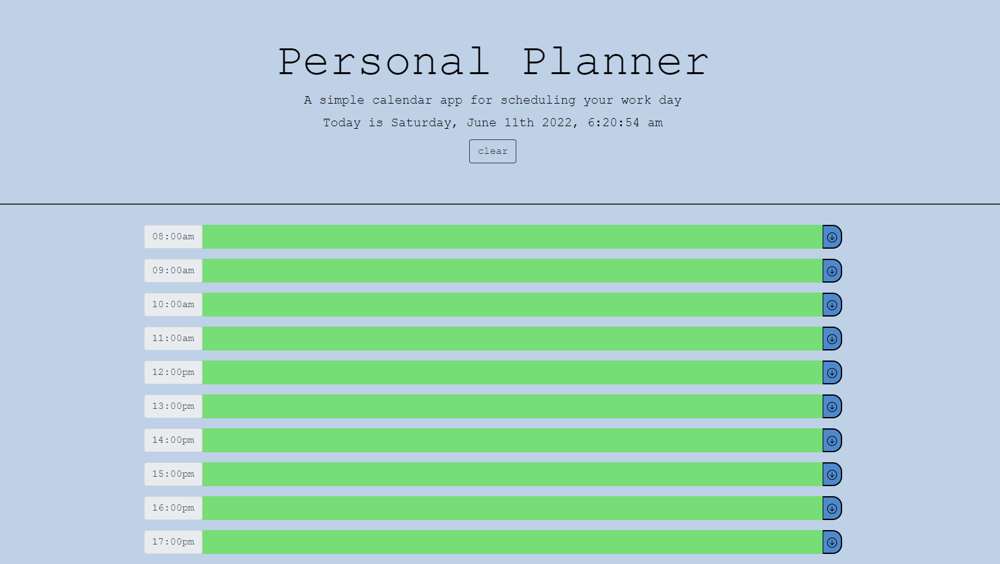

# Personal Planner

## Description

If you're juggling a full time job, bootcamp/college, personal hobbies, and exercise like myself your schedule is packed with activities. A lot of websites and apps help busy individuals keep track of their day. With this concept in mind I wanted to produce a website that a user can see and enter in their events accordingly. To make this planner or schedule more useful, keeping track of events that are in the past or future has been implemented. With future iterations I hope to take this even further! Having the events saved even have the user refreshes the page would be helpful so that they do not have to worry about their multiple entries being lost or deleted. Lastly, another iteration I hope to implement and understand in the future is maybe providing a link to your personal electronic calender so that you won't have to always visit the website to keep track of your day to day business.

## Deployed Application

https://leelai064.github.io/PersonalScheduler/

## Github Repository Access

https://github.com/Leelai064/PersonalScheduler

## Website Visual Examples

## Website Walkthrough

## Credits

Getbootstrap was used for button decal